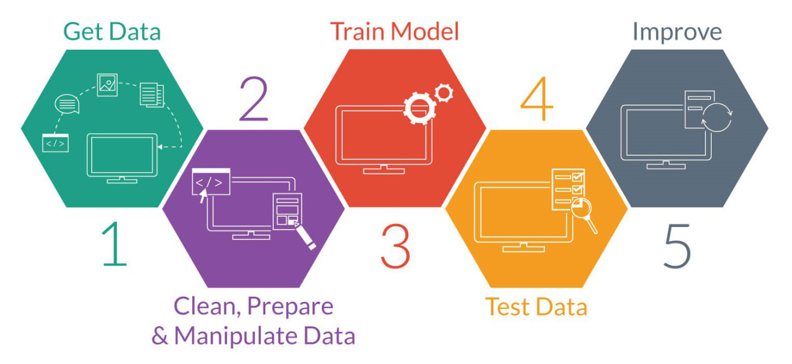

# AI Technologies Overview

## AI Applications in Various Formats

  

### Text to Audio
- [Suno](https://suno.com)

### Text to Text
- [ChatGPT](https://chat.openai.com/)

### Text to Video
- [Sora](https://sora.com)

### Text to Image
- [Midjourney](https://www.midjourney.com/)

### Additional Examples
- [Whisper](https://openai.com/research/whisper) - Speech to Text
- [Deepgram](https://deepgram.com/ai-voice-generator) - Text to Speech
- [GenieAi](https://www.genieai.io/) - Text to Interactive Video
- [GitHub Copilot](https://copilot.github.com) - Code Generation
- [Meshy](https://www.meshy.ai/)

## What is AI? Understanding Common Terms

  

### 1. AI - Artificial Intelligence
**Definition:** The capability of a machine to imitate intelligent human behavior.  
**Example:** Smart assistants like Siri or Alexa.

### 2. ML - Machine Learning
**Definition:** Training computers to learn from data and make decisions without explicit programming.  
**Example:** Netflix's movie recommendation system.

### 3. DL - Deep Learning
**Definition:** A subset of ML using neural networks with many layers to learn from large amounts of data.  
**Example:** Voice recognition systems in smartphones.

  

### 4. NLP - Natural Language Processing
**Definition:** Programming computers to process and understand human language.  
**Example:** Grammarly for writing assistance.

### 5. CV - Computer Vision
**Definition:** Training computers to interpret and understand the visual world from images and videos.  
**Example:** Self-driving cars using cameras to navigate.

### 6. AGI - Artificial General Intelligence
**Definition:** AI that can understand, learn, and apply knowledge across a wide range of tasks like a human.  
**Example:** A futuristic robot performing various tasks.

## Sample AI Development Process

  

  

## Conclusion

- **Future of AI:** Insights into upcoming advancements.
- **Getting Started:** First steps for beginners in AI.

